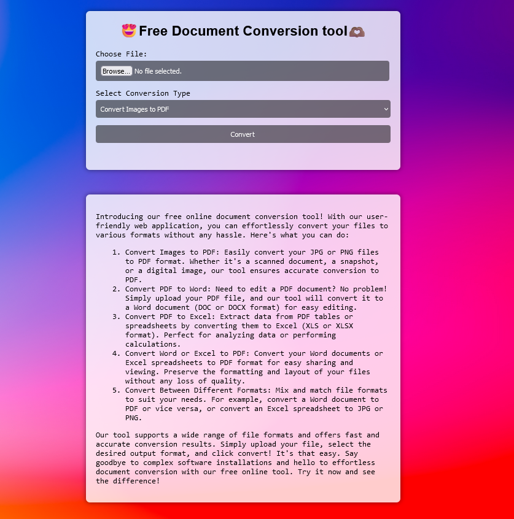

# Document Conversion Tool

## Description

This is a free online document conversion tool that allows users to convert files between different formats easily.

## Features

- Convert PDF to DOCX, JPG, PNG, and other formats.
- Convert DOCX to JPG, PNG, and other formats.
- Convert images to DOCX, PDF, and other formats.
- Supports various file formats, including PDF, DOCX, JPG, and PNG.

## How to Use

1. Upload your file by clicking the "Choose File" button.
2. Select the desired conversion type from the dropdown menu.
3. Click the "Convert" button to initiate the conversion process.
4. Once the conversion is complete, the converted file will be available for download.

## Screenshots

## Author

[Your Name](https://github.com/yourusername)
